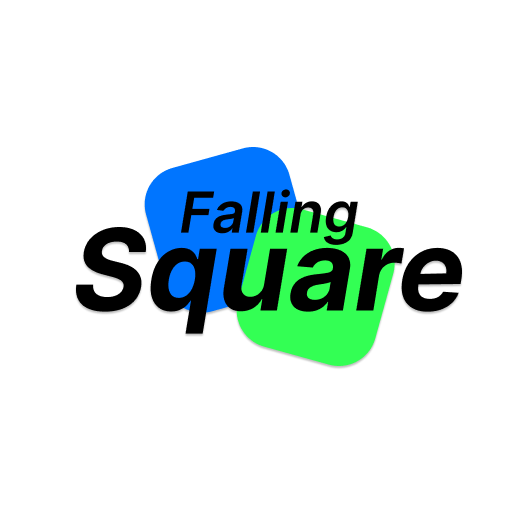
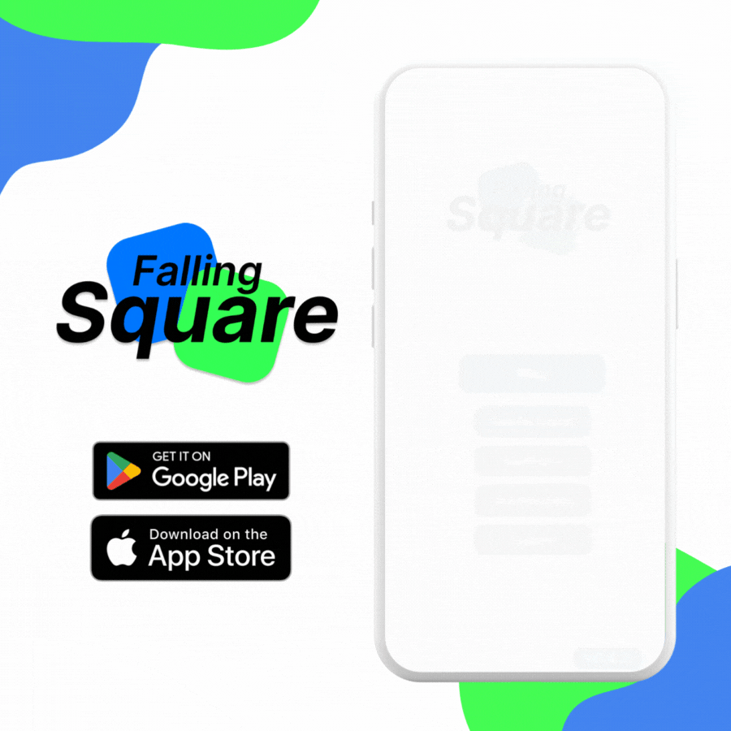

    
  
    
  
  # Falling Square

  A simple mobile game where the goal it's to touch random square before everything explode. It's 100% made with godot and released under MIT license. It's currently available on play store and app store.

   
  

## Feature

- 🟦 Touch squares before they go out of the screen
- ✨ Increase your combo when you doesn't miss any square
- 🎁 Special items can help you to beat your record
- 📝 And many others are coming soon !

## Roadmap

This is the current roadmap before the `v1.0.0` will be release :

- [x] Online score board.
- [x] Improve visual effects.
- [x] Add sound effects.
- [x] Build an iOS version.
- [ ] Add achievements.

## Download

  

  

## License

MIT License © 2022 [Emilien Leroy](https://github.com/EmilienLeroy)